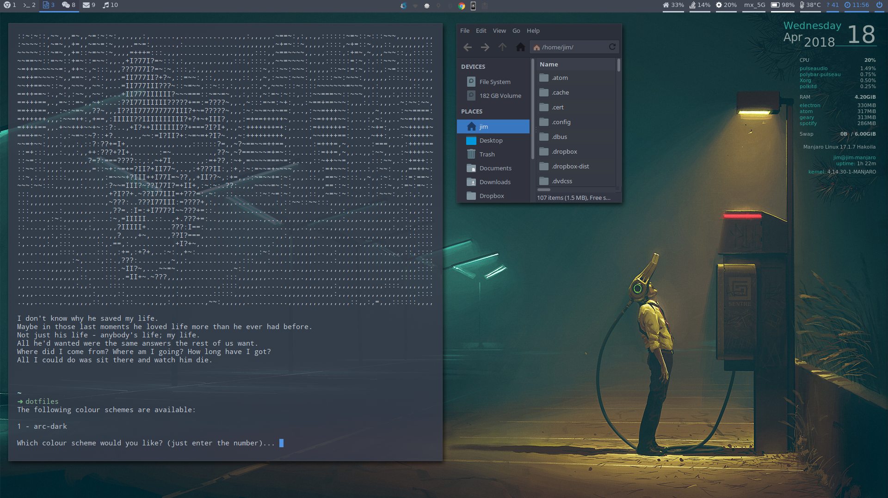

# dotfiles-manjaro-i3

My personal dotfiles for Manjaro i3 edition.

I use `scripts/dotfiles` to auto generate some config files using the colour schemes in `config/color-schemes` and the templates in `config/templates`. Just run the `dofiles` command to apply a colour scheme.

- i3
- zsh
- rofi
- polybar
- compton
- wpgtk

Usual disclaimer - I hope this helps you but please be careful, make sure you know what you're doing, and don't blindly run the scripts :)

This project is licensed under the terms of the MIT license.

